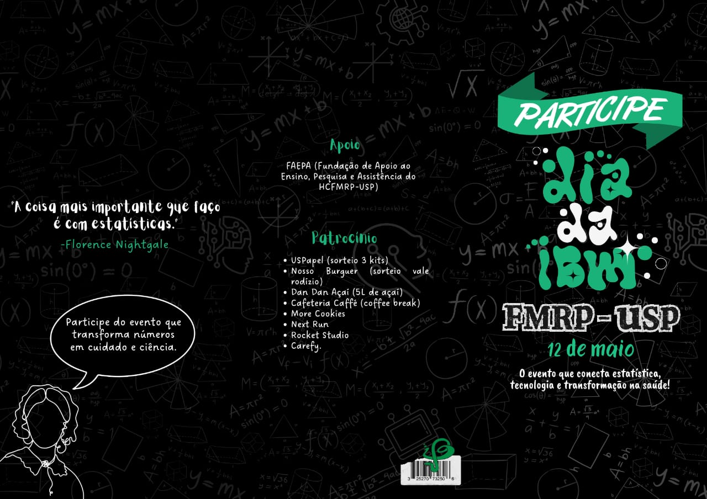

# IBm_day_2025



## Minicurso em Bioinformática
### Daniel Tiezzi

#### Perfil molecular do câncer de endométrio - classificação não supervisionada

Utilizar linguagem R

Por meio de algoritmos de clusterização não supervisionada iremos analisar como o câncer de endométrio pode ser classificado baseado no perfil de expressão global dos genes utilizando dados de sequenciamento de RNA.


#### Classificação surpervisionada

Utilizar linguagem Python.
É recomendado instalar um software para gerenciameto de ambinetes em Python. Eu utilizo o miniconda em Linux.

Para Linux (distribuições baseadas no Debian): 
wget https://repo.anaconda.com/miniconda/Miniconda3-latest-Linux-x86_64.sh
bash Miniconda3-latest-Linux-x86_64.sh

Vamos utilizar a classificação molecular criada no módulo anterior e testar a acurácia de modelos de aprendizado de máquina em predizer o subtipo.

É necessário as bibliotecas [Scikit Learn](https://scikit-learn.org/stable/), [SciPy](https://scipy.org/), [Pandas](https://pandas.pydata.org/) e [Matplotlib](https://matplotlib.org/).

```shell
conda create -n minicurso python=3.10 -y
conda activate minicurso
conda install pandas
conda install conda-forge::scikit-learn
conda install conda-forge::scipy
conda install conda-forge::matplotlib

git clone https://github.com/dtiezzi/IBm_day_2025.git
cd IBm_day_2025
```

Para utilizar o Google Colab tente converter o arquivo .py

```shell
pip install colab-convert
import colab-convert
colab-convert minicurso.py minicurso.ipynb
```
